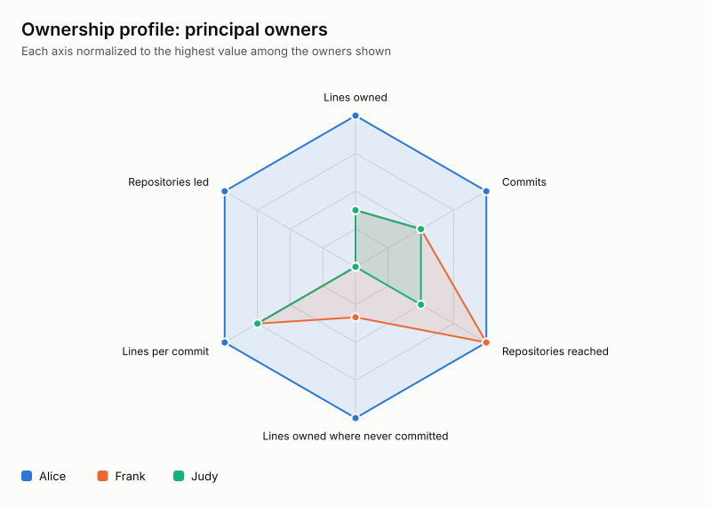
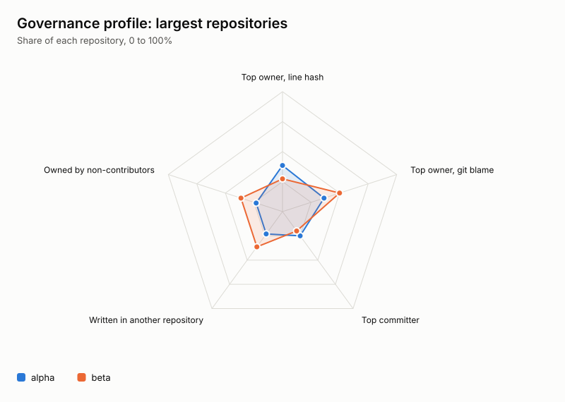
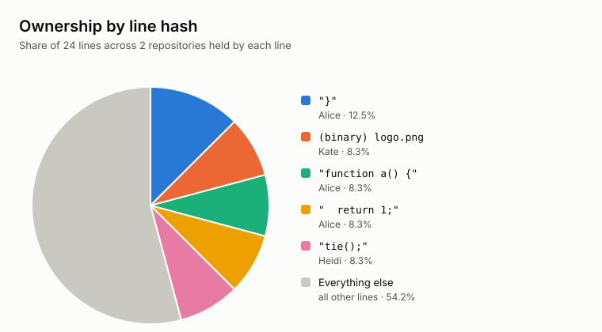
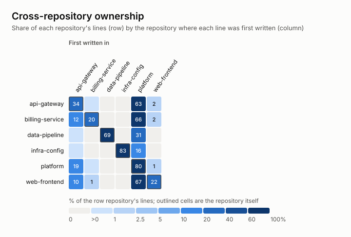
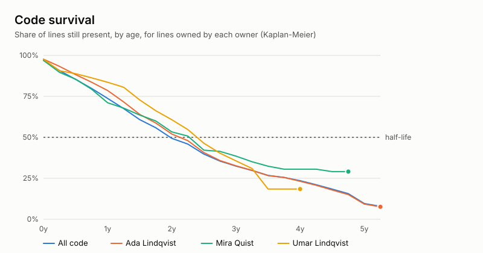
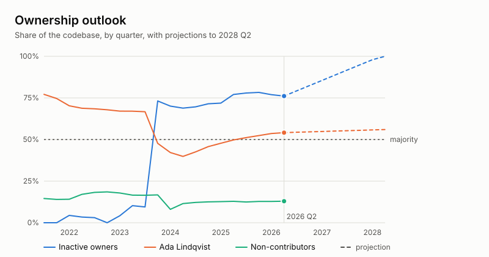
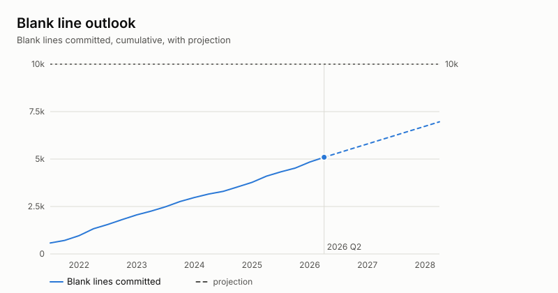

# OWNH Ownership Report

Repositories: 6. Lines under management: 17,456.
OWNH 0.1.0.
Database: `sample.db`. Generated 2026-10-10 13:23 UTC.

## AI insights (AI-generated)

OWNH covers fewer than ten repositories, dozens of owners, and tens of thousands of lines. Ownership is concentrated: Ada Lindqvist holds 54.4% of lines, compared with 10.6% for Mira Quist and 6.5% for Umar Lindqvist.

At 2026 Q2, principal-owner share is 54.3%, up from 51.2% at 2025 Q3. Inactive-owner share is 76.3%, down from 77.9% over the same period; both majorities are already established. The next blank-line milestone is projected for 2031 Q4.

Cross-repository ownership remains uneven, and methods agree in no repositories. Removed lines equal 48.7% of added lines, with 95.6% of removals belonging to others; Fiona Format accounts for 30.4% of removals. Code survival has a two-year half-life, not a projection.

_Written by AI (openai/gpt-6-luna) from OWNH's figures; every number was checked against the data. Names were replaced with tokens before anything left this machine._

## Principal owners

| Rank | Owner                                         | Lines | Share |
|-----:|-----------------------------------------------|------:|------:|
|    1 | Ada Lindqvist <ada.lindqvist@example.com>     | 9,490 | 54.4% |
|    2 | Mira Quist <mira.quist@example.com>           | 1,856 | 10.6% |
|    3 | Umar Lindqvist <umar.lindqvist@example.com>   | 1,132 |  6.5% |
|    4 | Fiona Format <fiona.format@example.com>       | 1,111 |  6.4% |
|    5 | Rosa Garcia <rosa.garcia@example.com>         |   512 |  2.9% |
|    6 | Juno Rasmussen <juno.rasmussen@example.com>   |   351 |  2.0% |
|    7 | Ines Dahl <ines.dahl@example.com>             |   300 |  1.7% |
|    8 | Ivar Fischer <ivar.fischer@example.com>       |   224 |  1.3% |
|    9 | Pavel Rasmussen <pavel.rasmussen@example.com> |   221 |  1.3% |
|   10 | Greta Okafor <greta.okafor@example.com>       |   218 |  1.2% |
|   11 | Vera Tanaka <vera.tanaka@example.com>         |   140 |  0.8% |
|   12 | Nils Yilmaz <nils.yilmaz@example.com>         |   134 |  0.8% |
|   13 | Dagny Petrov <dagny.petrov@example.com>       |   131 |  0.8% |
|   14 | Olga Fischer <olga.fischer@example.com>       |   130 |  0.7% |
|   15 | Wim Bianchi <wim.bianchi@example.com>         |   126 |  0.7% |

## Ownership profiles

## Principal lines

| Rank | Line                                                     | Lines | Share | Owner          | First written in |
|-----:|----------------------------------------------------------|------:|------:|----------------|------------------|
|    1 | `""`                                                     | 3,578 | 20.5% | Ada Lindqvist  | platform         |
|    2 | `"}"`                                                    | 1,118 |  6.4% | Ada Lindqvist  | platform         |
|    3 | `"  }"`                                                  | 1,105 |  6.3% | Ada Lindqvist  | platform         |
|    4 | `"    }"`                                                |   583 |  3.3% | Mira Quist     | api-gateway      |
|    5 | `"    return null;"`                                     |   533 |  3.1% | Ada Lindqvist  | platform         |
|    6 | `"        return null;"`                                 |   288 |  1.6% | Mira Quist     | api-gateway      |
|    7 | `"        return None"`                                  |   224 |  1.3% | Umar Lindqvist | data-pipeline    |
|    8 | `"/*"`                                                   |   198 |  1.1% | Ada Lindqvist  | platform         |
|    9 | `" * Copyright Example Corp. All rights reserved."`      |   193 |  1.1% | Ada Lindqvist  | platform         |
|   10 | `" * Licensed under the Example Corp internal license."` |   189 |  1.1% | Ada Lindqvist  | platform         |
|   11 | `" */"`                                                  |   186 |  1.1% | Ada Lindqvist  | platform         |
|   12 | `"'use strict';"`                                        |   180 |  1.0% | Ada Lindqvist  | platform         |
|   13 | `"  return result;"`                                     |    76 |  0.4% | Ada Lindqvist  | platform         |
|   14 | `"  return value;"`                                      |    70 |  0.4% | Ada Lindqvist  | platform         |
|   15 | `"  if (!result) {"`                                     |    70 |  0.4% | Ada Lindqvist  | platform         |

## Cross-repository ownership

Rows are the repository where a line lives; columns are the repository where
that line was first written, and so where its owner acquired it.

| Repository      | Lines | Owned from other repos | Owned by non-contributors | Largest outside source |
|-----------------|------:|-----------------------:|--------------------------:|------------------------|
| api-gateway     | 3,528 |                  66.2% |                     57.4% | platform (63.5%)       |
| billing-service | 2,089 |                  79.6% |                     11.0% | platform (65.9%)       |
| data-pipeline   | 3,189 |                  31.0% |                      0.0% | platform (31.0%)       |
| infra-config    |   365 |                  16.4% |                      0.0% | platform (16.4%)       |
| platform        | 4,551 |                  20.0% |                      0.3% | api-gateway (18.6%)    |
| web-frontend    | 3,734 |                  78.2% |                      0.4% | platform (66.9%)       |

Non-contributors own lines in a repository without a single commit to it.

## Three ways to own a repository

The top owner of each repository by commit count, by `git blame`, and by line hash.
Blame shows "-" until `bin/ownh.js blame` has covered every file (or every file of its sample).
Values marked ~ are estimates from a random sample of files, with a 95% margin in percentage points.

| Repository           | By commits              | By blame               | By line hash          | Agree |
|----------------------|-------------------------|------------------------|-----------------------|-------|
| **All repositories** | Rosa Garcia (10.0%)     | Fiona Format (15.8%)   | Ada Lindqvist (54.4%) | no    |
| api-gateway          | Juno Rasmussen (17.4%)  | Fiona Format (23.2%)   | Ada Lindqvist (57.3%) | no    |
| billing-service      | Freja Eriksen (12.5%)   | Juno Rasmussen (16.8%) | Ada Lindqvist (63.0%) | no    |
| data-pipeline        | Rosa Garcia (44.4%)     | Rosa Garcia (37.3%)    | Ada Lindqvist (32.0%) | no    |
| infra-config         | Yusuf Ulrich (24.5%)    | Cleo Bianchi (29.3%)   | Greta Okafor (52.6%)  | no    |
| platform             | Pavel Rasmussen (14.3%) | Fiona Format (23.2%)   | Ada Lindqvist (59.3%) | no    |
| web-frontend         | Juno Rasmussen (14.1%)  | Fiona Format (14.8%)   | Ada Lindqvist (63.4%) | no    |

The three methods agree on 0 of 6 repositories.

## Leverage

Lines owned today for every line written. Identical lines are owned by whoever wrote them first, so one
line written can be many lines owned.

### Highest leverage

| Owner                                       | Lines written | Lines owned | Owned per line written |
|---------------------------------------------|--------------:|------------:|-----------------------:|
| Ada Lindqvist <ada.lindqvist@example.com>   |         1,920 |       9,490 |                   4.94 |
| Mira Quist <mira.quist@example.com>         |         1,230 |       1,856 |                   1.51 |
| Umar Lindqvist <umar.lindqvist@example.com> |         1,493 |       1,132 |                   0.76 |
| Greta Okafor <greta.okafor@example.com>     |           544 |         218 |                   0.40 |
| Olga Fischer <olga.fischer@example.com>     |           407 |         130 |                   0.32 |
| Wim Bianchi <wim.bianchi@example.com>       |           451 |         126 |                   0.28 |
| Ines Dahl <ines.dahl@example.com>           |         1,090 |         300 |                   0.28 |
| Fiona Format <fiona.format@example.com>     |         5,074 |       1,111 |                   0.22 |
| Ivar Fischer <ivar.fischer@example.com>     |         1,127 |         224 |                   0.20 |
| Sven Silva <sven.silva@example.com>         |           571 |         110 |                   0.19 |

### Lowest retention among the most prolific writers

| Owner                                       | Lines written | Lines owned | Owned per line written |
|---------------------------------------------|--------------:|------------:|-----------------------:|
| Juno Rasmussen <juno.rasmussen@example.com> |         3,551 |         351 |                   0.10 |
| Beatrix Varga <beatrix.varga@example.com>   |         1,037 |         103 |                   0.10 |
| Bruno Tanaka <bruno.tanaka@example.com>     |           598 |          63 |                   0.11 |
| Yusuf Ulrich <yusuf.ulrich@example.com>     |           590 |          63 |                   0.11 |
| Freja Eriksen <freja.eriksen@example.com>   |           931 |         105 |                   0.11 |
| Dagny Petrov <dagny.petrov@example.com>     |         1,084 |         131 |                   0.12 |
| Nils Yilmaz <nils.yilmaz@example.com>       |         1,081 |         134 |                   0.12 |
| Kasimir Zeller <kasimir.zeller@example.com> |           611 |          81 |                   0.13 |
| Farid Costa <farid.costa@example.com>       |           703 |          97 |                   0.14 |
| Zora Costa <zora.costa@example.com>         |           831 |         115 |                   0.14 |

## Code demolition

34,094 lines added and 16,620 removed in total; 15,896 of the removed lines (95.6%) belonged to someone other than the person removing them.

### Most lines removed that belonged to others

| Rank | Remover                                       | Lines | Own lines removed |
|-----:|-----------------------------------------------|------:|------------------:|
|    1 | Fiona Format <fiona.format@example.com>       | 5,053 |                21 |
|    2 | Juno Rasmussen <juno.rasmussen@example.com>   | 1,256 |                36 |
|    3 | Rosa Garcia <rosa.garcia@example.com>         |   866 |               169 |
|    4 | Pavel Rasmussen <pavel.rasmussen@example.com> |   599 |                16 |
|    5 | Vera Tanaka <vera.tanaka@example.com>         |   564 |                 8 |
|    6 | Ivar Fischer <ivar.fischer@example.com>       |   532 |                10 |
|    7 | Umar Lindqvist <umar.lindqvist@example.com>   |   473 |                11 |
|    8 | Cleo Bianchi <cleo.bianchi@example.com>       |   426 |                 1 |
|    9 | Freja Eriksen <freja.eriksen@example.com>     |   425 |                 0 |
|   10 | Tove Andersen <tove.andersen@example.com>     |   370 |                 5 |

### Most lines lost to others

| Rank | Owner                                         | Lines | Own lines removed |
|-----:|-----------------------------------------------|------:|------------------:|
|    1 | Ada Lindqvist <ada.lindqvist@example.com>     | 8,426 |                84 |
|    2 | Mira Quist <mira.quist@example.com>           | 2,075 |                45 |
|    3 | Fiona Format <fiona.format@example.com>       | 1,058 |                21 |
|    4 | Greta Okafor <greta.okafor@example.com>       |   700 |                48 |
|    5 | Umar Lindqvist <umar.lindqvist@example.com>   |   561 |                11 |
|    6 | Juno Rasmussen <juno.rasmussen@example.com>   |   401 |                36 |
|    7 | Ines Dahl <ines.dahl@example.com>             |   375 |                66 |
|    8 | Pavel Rasmussen <pavel.rasmussen@example.com> |   274 |                16 |
|    9 | Yusuf Ulrich <yusuf.ulrich@example.com>       |   251 |                31 |
|   10 | Rosa Garcia <rosa.garcia@example.com>         |   227 |               169 |

Removals inside merge commits are not counted: they are relative to git's re-run of the merge, not to a parent.

## Code survival

- All code: half-life of 2.0 years.
- Ada Lindqvist: half-life of 2.3 years.
- Mira Quist: half-life of 2.3 years.
- Umar Lindqvist: half-life of 2.5 years.

Copies of the same line are indistinguishable, so removals are paired with the oldest surviving copies of that line first. Lines still present count as surviving at their current age. A half-life marked projected extends an exponential decay through the last point.

## Outlook

- **Knowledge retention:** Contributors with no commit in the past year have owned the majority of the codebase since 2023 Q4 (now 76.3%).
- **Principal owner:** Ada Lindqvist has owned the majority of the codebase since 2025 Q3 (now 54.3%).
- **Blank lines:** 5,095 blank lines have been committed. At the current rate, the 10,000th arrives in 2031 Q4 (fit over 2023 Q3 to 2026 Q2, R² 0.99).

| Quarter | Lines under management |   QoQ | New owners | Ada Lindqvist | Non-contributors | Inactive owners | Blank lines committed |
|---------|-----------------------:|------:|-----------:|--------------:|-----------------:|----------------:|----------------------:|
| 2024 Q3 |                 11,927 | +2.7% |          1 |         42.6% |            12.2% |           69.6% |                 3,298 |
| 2024 Q4 |                 12,917 | +8.3% |          3 |         45.7% |            12.5% |           71.5% |                 3,534 |
| 2025 Q1 |                 13,706 | +6.1% |          2 |         47.8% |            12.7% |           71.9% |                 3,772 |
| 2025 Q2 |                 14,786 | +7.9% |          2 |         49.7% |            12.9% |           77.1% |                 4,098 |
| 2025 Q3 |                 15,506 | +4.9% |          3 |         51.2% |            12.5% |           77.9% |                 4,328 |
| 2025 Q4 |                 15,709 | +1.3% |          0 |         52.4% |            12.8% |           78.3% |                 4,525 |
| 2026 Q1 |                 16,737 | +6.5% |          0 |         53.6% |            12.8% |           77.0% |                 4,843 |
| 2026 Q2 |                 17,474 | +4.4% |          0 |         54.3% |            13.0% |           76.3% |                 5,095 |

Projections continue the trend of the last 12 quarters (least-squares slope) from the latest value. Series are lines added minus lines removed, each line owned by whoever first wrote it; at 2026 Q2 they total 17,474 lines against 17,456 at HEAD (lines added on branches whose changes a merge discarded are never removed). The blank-line series counts blank lines as committed. "Inactive" means no commit in the current or previous three quarters. "Now" is the quarter of the newest commit analyzed.

## OKR draft (AI-generated)

**Objective:** Build more balanced, current, and consistently measured code ownership across the portfolio.

- **KR1** (at risk): Reduce principal-owner concentration from its 2026 Q2 baseline of 54.3%, which has risen from 51.2% at 2025 Q3.
- **KR2** (on track): Reduce inactive-owner concentration from its 2026 Q2 baseline of 76.3%; it remains a majority despite declining from 77.9% at 2025 Q3.
- **KR3** (off track): Establish cross-method agreement from a baseline of no repositories where methods agree.

_Written by AI (openai/gpt-6-luna) from OWNH's figures; every number was checked against the data. Names were replaced with tokens before anything left this machine._

## Ownership archetypes

| Archetype                | Rule                                                                     | Owners | Share of lines | Examples                                  |
|--------------------------|--------------------------------------------------------------------------|-------:|---------------:|-------------------------------------------|
| Lead Owner (AI)          | The single owner with the most lines.                                    |      1 |          54.4% | Ada Lindqvist                             |
| Dormant Stewards (AI)    | Owners with no commit in the last 4 quarters.                            |     12 |          76.4% | Ada Lindqvist, Mira Quist, Fiona Format   |
| Cross-Repo Absentee (AI) | Owners with most of their lines in repositories they never committed to. |      1 |           0.1% | Quinn Zeller                              |
| Code Removers (AI)       | People who removed more lines belonging to others than they own.         |      9 |          15.8% | Fiona Format, Rosa Garcia, Juno Rasmussen |
| Automated Steward (AI)   | Automated accounts (bots) that own lines.                                |      1 |           0.2% | depbot[bot]                               |

_Archetype names written by AI; membership is computed by OWNH._

## Oddities

- The most-owned line has no letters or digits. `""` appears 3,578 times (20.5% of all lines) and belongs to Ada Lindqvist, who wrote it first in platform.
- 6 of the top 15 lines are whitespace or punctuation. Together they hold 38.8% of all lines: `""`, `"}"`, `"  }"`, `"    }"`, `"/*"`, and 1 more.
- web-frontend was mostly written somewhere else. 66.9% of its lines were first written in platform; 21.8% in web-frontend itself.
- billing-service was mostly written somewhere else. 65.9% of its lines were first written in platform; 20.4% in billing-service itself.
- api-gateway was mostly written somewhere else. 63.5% of its lines were first written in platform; 33.8% in api-gateway itself.
- 1 of 6 repositories is owned by someone who never committed to it. api-gateway (Ada Lindqvist, 57.3%).
- In 1 repository, most lines belong to people who never committed there. api-gateway (57.4%).
- Three methods, three owners, in 5 repositories. api-gateway (Juno Rasmussen / Fiona Format / Ada Lindqvist), billing-service (Freja Eriksen / Juno Rasmussen / Ada Lindqvist), infra-config (Yusuf Ulrich / Cleo Bianchi / Greta Okafor), platform (Pavel Rasmussen / Fiona Format / Ada Lindqvist), web-frontend (Juno Rasmussen / Fiona Format / Ada Lindqvist).
- Fiona Format has removed 5,053 lines that belonged to others. More than anyone else, against 21 of their own.
- The most-deleted line. `"  }"` has been removed 1,562 times. It belongs to Ada Lindqvist.
- 22,013 lines were added again after being deleted. Each went straight back to its original owner (983 distinct lines).

## Repositories

### api-gateway

| Rank | Owner                                         | Lines | Share | Commits here |
|-----:|-----------------------------------------------|------:|------:|--------------|
|    1 | Ada Lindqvist <ada.lindqvist@example.com>     | 2,023 | 57.3% | none         |
|    2 | Mira Quist <mira.quist@example.com>           |   491 | 13.9% | yes          |
|    3 | Fiona Format <fiona.format@example.com>       |   398 | 11.3% | yes          |
|    4 | Juno Rasmussen <juno.rasmussen@example.com>   |    95 |  2.7% | yes          |
|    5 | Hugo Varga <hugo.varga@example.com>           |    90 |  2.6% | yes          |
|    6 | Nils Yilmaz <nils.yilmaz@example.com>         |    85 |  2.4% | yes          |
|    7 | Dagny Petrov <dagny.petrov@example.com>       |    80 |  2.3% | yes          |
|    8 | Sven Silva <sven.silva@example.com>           |    49 |  1.4% | yes          |
|    9 | Umar Lindqvist <umar.lindqvist@example.com>   |    41 |  1.2% | yes          |
|   10 | Ines Dahl <ines.dahl@example.com>             |    26 |  0.7% | yes          |
|   11 | Pavel Rasmussen <pavel.rasmussen@example.com> |    25 |  0.7% | yes          |
|   12 | Vera Tanaka <vera.tanaka@example.com>         |    22 |  0.6% | yes          |
|   13 | Bruno Tanaka <bruno.tanaka@example.com>       |    15 |  0.4% | yes          |
|   14 | depbot[bot] <depbot@example.com>              |    10 |  0.3% | yes          |
|   15 | Gustav Quist <gustav.quist@example.com>       |     9 |  0.3% | yes          |

### billing-service

| Rank | Owner                                         | Lines | Share | Commits here |
|-----:|-----------------------------------------------|------:|------:|--------------|
|    1 | Ada Lindqvist <ada.lindqvist@example.com>     | 1,316 | 63.0% | yes          |
|    2 | Mira Quist <mira.quist@example.com>           |   213 | 10.2% | none         |
|    3 | Fiona Format <fiona.format@example.com>       |   133 |  6.4% | yes          |
|    4 | Juno Rasmussen <juno.rasmussen@example.com>   |    61 |  2.9% | yes          |
|    5 | Vera Tanaka <vera.tanaka@example.com>         |    60 |  2.9% | yes          |
|    6 | Zora Costa <zora.costa@example.com>           |    49 |  2.3% | yes          |
|    7 | Freja Eriksen <freja.eriksen@example.com>     |    45 |  2.2% | yes          |
|    8 | Pavel Rasmussen <pavel.rasmussen@example.com> |    24 |  1.1% | yes          |
|    9 | Casper Dahl <casper.dahl@example.com>         |    21 |  1.0% | yes          |
|   10 | Aron Okafor <aron.okafor@example.com>         |    20 |  1.0% | yes          |
|   11 | Gustav Quist <gustav.quist@example.com>       |    17 |  0.8% | yes          |
|   12 | Cleo Bianchi <cleo.bianchi@example.com>       |    16 |  0.8% | yes          |
|   13 | Ines Dahl <ines.dahl@example.com>             |    14 |  0.7% | none         |
|   14 | Farid Costa <farid.costa@example.com>         |    13 |  0.6% | yes          |
|   15 | Ivar Fischer <ivar.fischer@example.com>       |    12 |  0.6% | yes          |

### data-pipeline

| Rank | Owner                                         | Lines | Share | Commits here |
|-----:|-----------------------------------------------|------:|------:|--------------|
|    1 | Ada Lindqvist <ada.lindqvist@example.com>     | 1,020 | 32.0% | yes          |
|    2 | Umar Lindqvist <umar.lindqvist@example.com>   |   979 | 30.7% | yes          |
|    3 | Rosa Garcia <rosa.garcia@example.com>         |   423 | 13.3% | yes          |
|    4 | Ines Dahl <ines.dahl@example.com>             |   180 |  5.6% | yes          |
|    5 | Olga Fischer <olga.fischer@example.com>       |   125 |  3.9% | yes          |
|    6 | Wim Bianchi <wim.bianchi@example.com>         |   118 |  3.7% | yes          |
|    7 | Ivar Fischer <ivar.fischer@example.com>       |    61 |  1.9% | yes          |
|    8 | Casper Dahl <casper.dahl@example.com>         |    56 |  1.8% | yes          |
|    9 | Farid Costa <farid.costa@example.com>         |    53 |  1.7% | yes          |
|   10 | Emil Weber <emil.weber@example.com>           |    48 |  1.5% | yes          |
|   11 | Beatrix Varga <beatrix.varga@example.com>     |    26 |  0.8% | yes          |
|   12 | Dmitri Moreau <dmitri.moreau@example.com>     |    22 |  0.7% | yes          |
|   13 | Pavel Rasmussen <pavel.rasmussen@example.com> |    19 |  0.6% | yes          |
|   14 | Dagny Petrov <dagny.petrov@example.com>       |    18 |  0.6% | yes          |
|   15 | Jonas Petrov <jonas.petrov@example.com>       |     8 |  0.3% | yes          |

### infra-config

| Rank | Owner                                       | Lines | Share | Commits here |
|-----:|---------------------------------------------|------:|------:|--------------|
|    1 | Greta Okafor <greta.okafor@example.com>     |   192 | 52.6% | yes          |
|    2 | Ada Lindqvist <ada.lindqvist@example.com>   |    66 | 18.1% | yes          |
|    3 | Yusuf Ulrich <yusuf.ulrich@example.com>     |    40 | 11.0% | yes          |
|    4 | Juno Rasmussen <juno.rasmussen@example.com> |    24 |  6.6% | yes          |
|    5 | Tove Andersen <tove.andersen@example.com>   |    14 |  3.8% | yes          |
|    6 | Cleo Bianchi <cleo.bianchi@example.com>     |    13 |  3.6% | yes          |
|    7 | Rosa Garcia <rosa.garcia@example.com>       |     3 |  0.8% | yes          |
|    8 | Beatrix Varga <beatrix.varga@example.com>   |     2 |  0.5% | yes          |
|    9 | Dmitri Moreau <dmitri.moreau@example.com>   |     2 |  0.5% | yes          |
|   10 | Gustav Quist <gustav.quist@example.com>     |     2 |  0.5% | yes          |
|   11 | Farid Costa <farid.costa@example.com>       |     1 |  0.3% | yes          |
|   12 | Freja Eriksen <freja.eriksen@example.com>   |     1 |  0.3% | yes          |
|   13 | Ivar Fischer <ivar.fischer@example.com>     |     1 |  0.3% | yes          |
|   14 | Kaia Weber <kaia.weber@example.com>         |     1 |  0.3% | yes          |
|   15 | Lars Eriksen <lars.eriksen@example.com>     |     1 |  0.3% | yes          |

### platform

| Rank | Owner                                         | Lines | Share | Commits here |
|-----:|-----------------------------------------------|------:|------:|--------------|
|    1 | Ada Lindqvist <ada.lindqvist@example.com>     | 2,698 | 59.3% | yes          |
|    2 | Mira Quist <mira.quist@example.com>           |   775 | 17.0% | yes          |
|    3 | Fiona Format <fiona.format@example.com>       |   364 |  8.0% | yes          |
|    4 | Pavel Rasmussen <pavel.rasmussen@example.com> |   125 |  2.7% | yes          |
|    5 | Kasimir Zeller <kasimir.zeller@example.com>   |    66 |  1.5% | yes          |
|    6 | Ivar Fischer <ivar.fischer@example.com>       |    52 |  1.1% | yes          |
|    7 | Freja Eriksen <freja.eriksen@example.com>     |    42 |  0.9% | yes          |
|    8 | Vera Tanaka <vera.tanaka@example.com>         |    42 |  0.9% | yes          |
|    9 | Cleo Bianchi <cleo.bianchi@example.com>       |    38 |  0.8% | yes          |
|   10 | Juno Rasmussen <juno.rasmussen@example.com>   |    37 |  0.8% | yes          |
|   11 | Bruno Tanaka <bruno.tanaka@example.com>       |    36 |  0.8% | yes          |
|   12 | Nils Yilmaz <nils.yilmaz@example.com>         |    32 |  0.7% | yes          |
|   13 | Dagny Petrov <dagny.petrov@example.com>       |    30 |  0.7% | yes          |
|   14 | Ines Dahl <ines.dahl@example.com>             |    23 |  0.5% | yes          |
|   15 | Rosa Garcia <rosa.garcia@example.com>         |    23 |  0.5% | yes          |

### web-frontend

| Rank | Owner                                         | Lines | Share | Commits here |
|-----:|-----------------------------------------------|------:|------:|--------------|
|    1 | Ada Lindqvist <ada.lindqvist@example.com>     | 2,367 | 63.4% | yes          |
|    2 | Mira Quist <mira.quist@example.com>           |   377 | 10.1% | yes          |
|    3 | Fiona Format <fiona.format@example.com>       |   216 |  5.8% | yes          |
|    4 | Juno Rasmussen <juno.rasmussen@example.com>   |   134 |  3.6% | yes          |
|    5 | Umar Lindqvist <umar.lindqvist@example.com>   |    93 |  2.5% | yes          |
|    6 | Ivar Fischer <ivar.fischer@example.com>       |    89 |  2.4% | yes          |
|    7 | Beatrix Varga <beatrix.varga@example.com>     |    65 |  1.7% | yes          |
|    8 | Ines Dahl <ines.dahl@example.com>             |    57 |  1.5% | yes          |
|    9 | Rosa Garcia <rosa.garcia@example.com>         |    54 |  1.4% | yes          |
|   10 | Sven Silva <sven.silva@example.com>           |    45 |  1.2% | yes          |
|   11 | Zora Costa <zora.costa@example.com>           |    37 |  1.0% | yes          |
|   12 | Dmitri Moreau <dmitri.moreau@example.com>     |    28 |  0.7% | yes          |
|   13 | Pavel Rasmussen <pavel.rasmussen@example.com> |    28 |  0.7% | yes          |
|   14 | Greta Okafor <greta.okafor@example.com>       |    24 |  0.6% | yes          |
|   15 | Vera Tanaka <vera.tanaka@example.com>         |    16 |  0.4% | yes          |

## Excluded patterns

None. Every file was analyzed.
